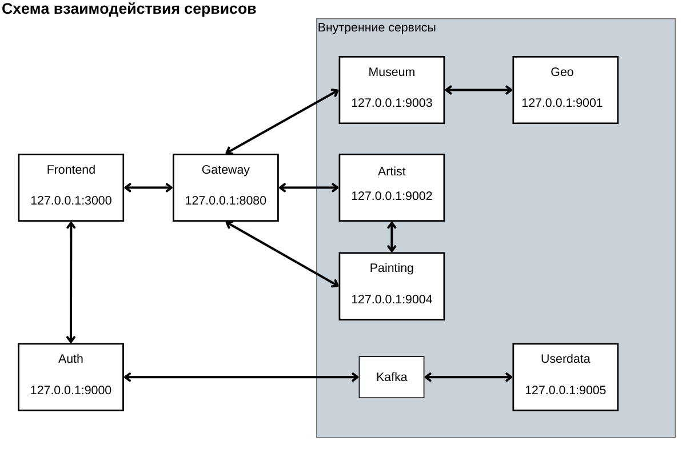
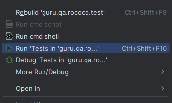

# 
<hr>

# О проекте
Rococo - микросервисное приложение для хранения картин, художников и музеев
# Архитектура приложения

#### Микросервисы в Rococo
+ [Rococo-auth]() - *Сервис авторизации*
+ [Rococo-gateway]() - *Api-шлюз, выполняет маршрутизацию запросов от "клиента" к другим микросервисам*
+ [Rococo-userdata]() - *Сервис для работы с профилями пользователей*
+ [Rococo-geo]() - *Сервис для работы с геоданными*
+ [Rococo-museum]() - *Сервис для работы с музеями*
+ [Rococo-painting]() - *Сервис для работы с картинами*
+ [Rococo-artist]() - *Сервис для работы с художниками*

#### Frontend приложения
+ [Rococo-client]() - *frontend приложения*

#### Схема микросервисов Rococo


## Минимальные предусловия для работы с проектом Rococo

#### 0. Если у вас ОС Windows

Необходимо использовать **bash terminal**, а не powershell.
Для запуска фронтенда локально необходимо использовать команду
`npm run build:windows`, если не работает стандартная команда `npm run dev`

#### 1. Установить docker (Если не установлен)

[Установка на Windows](https://docs.docker.com/desktop/install/windows-install/)

[Установка на Mac](https://docs.docker.com/desktop/install/mac-install/) (Для ARM и Intel разные пакеты)

[Установка на Linux](https://docs.docker.com/desktop/install/linux-install/)

После установки и запуска docker daemon необходимо убедиться в работе команд docker, например `docker -v`:

```posh
docker -v
Docker version 26.0.0, build 2ae903e
```

#### 2. Установить Java версии 21.

Версию установленной Java необходимо проверить командой `java -version`

```posh
java -version
openjdk version "21.0.3" 2024-04-16 LTS
OpenJDK Runtime Environment Temurin-21.0.3+9 (build 21.0.3+9-LTS)
OpenJDK 64-Bit Server VM Temurin-21.0.3+9 (build 21.0.3+9-LTS, mixed mode, sharing)
```

#### 3. Установить пакетный менеджер для сборки front-end npm

[Инструкция](https://docs.npmjs.com/downloading-and-installing-node-js-and-npm).
Рекомендованная версия Node.js - 18.13.0 (LTS)

#### 4. Создать volume для сохранения данных из БД в docker на вашем компьютере

```posh
docker volume create rococo
```

#### 5. Запустить Frontend, БД, zookeeper и kafka используя bash
(перед выполнением убедиться что скрипт будет выполняться в директории rococo)

В терминале выполнить:
```posh
bash localenv.sh 
```

#### 6. Установить одну из программ для визуальной работы с PostgreSQL

Например, DBeaver.

#### 7. Подключиться к БД postgres (host: localhost, port: 5432, user: postgres, pass: secret, database name: postgres), создать БД для микросервисов

```sql
create database "rococo-userdata" with owner postgres;
create database "rococo-auth" with owner postgres;
create database "rococo-museum" with owner postgres;   
create database "rococo-painting" with owner postgres;
create database "rococo-artist" with owner postgres;
create database "rococo-geo" with owner postgres;
```
<hr>

<a name="localrun"></a>
# Запуск Rococo локально в IDEA:

#### 1. В IDEA, находясь в директории rococo, для запуска Frontend, БД, zookeeper и kafka, выполнить bash скрипт:

```posh
bash localenv.sh 
```

#### 2. Прописать run конфигурацию для всех сервисов rococo Active profiles local

Для этого зайти в меню Run -> Edit Configurations -> выбрать main класс -> указать Active profiles: local

(Либо указать environment variables: spring.profiles.active=local)

(либо, находясь в редактировании конфигурации, как описано выше добавить для VM options: -Dspring.profiles.active=local)

[Инструкция](https://stackoverflow.com/questions/39738901/how-do-i-activate-a-spring-boot-profile-when-running-from-intellij)

#### 3. Запустить сервис Rococo-auth c помощью gradle или командой Run в IntelliJ IDEA:

- Запустить сервис auth командой gradle

```posh
./gradlew :rococo-auth:bootRun --args='--spring.profiles.active=local'
```

Либо выполнить запуск из IntelliJ IDEA перейдя к main-классу приложения RococoAuthApplication выбрать run в IntelliJ IDEA

(предварительно убедиться что
выполнен пункт с настройкой Active profiles)

#### 4. Запустить в любой последовательности другие сервисы: rococo-gateway, rococo-geo, rococo-userdata, rococo-museum, rococo-artist, rococo-painting
используя gradle команду
```posh
./gradlew :rococo-gateway:bootRun --args='--spring.profiles.active=local'
./gradlew :rococo-artist:bootRun --args='--spring.profiles.active=local'
./gradlew :rococo-geo:bootRun --args='--spring.profiles.active=local'
./gradlew :rococo-museum:bootRun --args='--spring.profiles.active=local'
./gradlew :rococo-painting:bootRun --args='--spring.profiles.active=local'
./gradlew :rococo-userdata:bootRun --args='--spring.profiles.active=local'
```
либо в ручную, перейдя main-классу каждого сервиса и выполнив команду run в IntelliJ IDEA

#### 5. Если необходимо выполнить вручную запуск frontend:
Выполняем команду в bash терминале, для перехода в каталог
```posh
cd rococo-client
```
Выполняем обновление зависимостей(в случае необходимости, если ранее команда не выполнялась) при помощи команды:
```posh
npm i
```
Следующей командой запускаем frontend
```posh
npm run dev
```
либо, если не сработала предыдущая, выполняем
```posh
npm run build:windows
```

<hr>

После запуска всего необходимого Rococo локально будет работать по адресу http://127.0.0.1:3000/

<hr>

<a name="localtestrun"></a>
# Запуск тестов локально:

#### 0. Убедиться что запущены все необходимые микросервисы, Frontend, БД, zookeeper и kafka из инструкции в предыдущих шагах

#### 1. Запустить тесты в ручном режиме

Для этого в IntelliJ IDEA необходимо находитсья по пути
`rococo-e2e-test/src/test/java/guru/qa/rococo/test/`

нажать правкой кнопкой мыши по папке test и выбрать коману Run `'Tests in ...'` как на изображении ниже

